# Despair Chinese Restaurant 🍜


**Live Site:** [https://despair.cc/](https://despair.cc/)  
**Heroku App:** [https://chinese-projectt-e5783e627929.herokuapp.com/](https://chinese-projectt-e5783e627929.herokuapp.com/)  
**GitHub Repository:** [https://github.com/unqe/Chinese-project](https://github.com/unqe/Chinese-project)  
**Project Board:** [https://github.com/users/unqe/projects/4](https://github.com/users/unqe/projects/4)

---

## Table of Contents

1. [Project Overview](#project-overview)
2. [UX Design](#ux-design)
   - [Strategy & Goals](#strategy--goals)
   - [User Stories](#user-stories)
   - [User Story Flow Diagrams](#user-story-flow-diagrams)
   - [Wireframes](#wireframes)
   - [Colour Palette](#colour-palette)
   - [Typography](#typography)
3. [Features](#features)
   - [Navigation & Header](#navigation--header)
   - [Menu Page](#menu-page)
   - [Item Detail Page](#item-detail-page)
   - [Basket](#basket)
   - [Checkout](#checkout)
   - [Order Confirmation & Status Tracking](#order-confirmation--status-tracking)
   - [Order History & Reorder](#order-history--reorder)
   - [Promo Codes](#promo-codes)
   - [Reviews](#reviews)
   - [User Accounts](#user-accounts)
   - [Kitchen Display (Staff)](#kitchen-display-staff)
   - [Django Admin (Jazzmin)](#django-admin-jazzmin)
   - [SEO, Legal & Technical Pages](#seo-legal--technical-pages)
4. [Data Model](#data-model)
5. [Agile Methodology](#agile-methodology)
6. [Technologies Used](#technologies-used)
   - [Management Commands](#management-commands)
7. [Testing](#testing)
   - [Automated Tests](#automated-tests)
   - [Automated Quality Checks](#automated-quality-checks)
   - [Manual Testing](#manual-testing)
   - [Validator Testing](#validator-testing)
   - [Browser Compatibility](#browser-compatibility)
   - [Responsive Design](#responsive-design)
   - [Bugs Fixed](#bugs-fixed)
   - [Unfixed Bugs](#unfixed-bugs)
   - [Future Features](#future-features)
8. [AI Usage](#ai-usage)
   - [Code Generation (LO8.1)](#code-generation-lo81)
   - [Debugging (LO8.2)](#debugging-lo82)
   - [Performance & UX Optimisation (LO8.3)](#performance--ux-optimisation-lo83)
   - [Unit Test Generation (LO8.4)](#unit-test-generation-lo84)
   - [Overall Workflow Impact (LO8.5)](#overall-workflow-impact-lo85)
9. [Deployment](#deployment)
10. [Site URLs Reference](#site-urls-reference)
11. [Credits](#credits)

---

## Project Overview

**Despair Chinese Restaurant** is a full-stack e-commerce web application for a fictional Chinese takeaway restaurant. The site is live at **[despair.cc](https://despair.cc/)** with a custom domain served over Heroku. Customers can browse a bilingual (English/Chinese) menu, add items to a session-based basket, apply promo codes, and place delivery or collection orders online.

The site delivers a realistic restaurant ordering experience end-to-end: from browsing the menu and managing a basket, through a full checkout with card/cash payment options, to live order status tracking, order history with one-click reorder, and a customer review system. A staff kitchen display provides live order management without requiring admin access, and a fully themed Jazzmin admin panel gives the owner complete control over every aspect of the site.

Built as a **Code Institute Portfolio Project 4** submission using Django 4.2 and deployed to Heroku with a PostgreSQL database, Cloudinary media storage, and a custom `despair.cc` domain.

**Core Goals:**
- Give customers a fast, intuitive ordering experience on any device
- Allow the restaurant owner to manage menu, orders, promos, reviews and opening hours from a single admin panel
- Provide kitchen staff with a live order display that updates automatically without admin access
- Demonstrate full-stack Django development skills: custom models, authentication, AJAX interactivity, bilingual content, rate limiting, and cloud deployment

---

## UX Design

### Strategy & Goals

| Goal | User Type | Met By |
|---|---|---|
| View the full menu with categories and filters | Customer | Menu page with category anchors, spice/dietary filters |
| Place an order for delivery or collection | Customer | Basket → Checkout → Confirmation flow |
| Track order status live | Customer | Order confirmation polling endpoint |
| Manage saved address for fast checkout | Registered user | Profile page |
| Read and write reviews | Customer | Reviews page, add/edit review views |
| Manage menu items from the front end | Staff | Sold-out toggle, image upload modal |
| See live incoming orders | Staff | Kitchen display with auto-refresh |
| Manage everything else | Admin | Django Jazzmin admin panel |

---

### User Stories

All user stories are tracked on the [GitHub Project Board](https://github.com/users/unqe/projects/4).

| ID | User Story | Priority | Status |
|---|---|---|---|
| [US01](https://github.com/unqe/Chinese-project/issues/1) | As a customer, I want to view the full menu with categories so I can decide what to order | Must Have | ✅ Done |
| [US02](https://github.com/unqe/Chinese-project/issues/2) | As a customer, I want to add items to a basket and manage quantities | Must Have | ✅ Done |
| [US03](https://github.com/unqe/Chinese-project/issues/3) | As a customer, I want to checkout and place an order | Must Have | ✅ Done |
| [US04](https://github.com/unqe/Chinese-project/issues/4) | As a visitor, I want to register an account | Must Have | ✅ Done |
| [US05](https://github.com/unqe/Chinese-project/issues/5) | As a registered user, I want to log in and out | Must Have | ✅ Done |
| [US06](https://github.com/unqe/Chinese-project/issues/6) | As a logged-in customer, I want to view my order history and reorder | Should Have | ✅ Done |
| [US07](https://github.com/unqe/Chinese-project/issues/7) | As a customer, I want to apply a promo/discount code at the basket | Should Have | ✅ Done |
| [US08](https://github.com/unqe/Chinese-project/issues/8) | As a new customer, I want a first-order discount automatically applied | Should Have | 🔄 In Progress |
| [US09](https://github.com/unqe/Chinese-project/issues/9) | As a customer who placed an order, I want to leave a review | Should Have | ✅ Done |
| [US10](https://github.com/unqe/Chinese-project/issues/10) | As a customer, I want to edit or delete my review | Should Have | ✅ Done |
| [US11](https://github.com/unqe/Chinese-project/issues/11) | As a logged-in user, I want to manage my profile and saved address | Should Have | ✅ Done |
| [US12](https://github.com/unqe/Chinese-project/issues/12) | As a user, I want to permanently delete my account (GDPR) | Could Have | ✅ Done |
| [US13](https://github.com/unqe/Chinese-project/issues/13) | As staff, I want to mark items as sold out from the live menu | Must Have | ✅ Done |
| [US14](https://github.com/unqe/Chinese-project/issues/14) | As kitchen staff, I want a live order display with status updates | Must Have | ✅ Done |
| [US15](https://github.com/unqe/Chinese-project/issues/15) | As a customer, I want to see live order status tracking | Could Have | 🔄 In Progress |
| [US16](https://github.com/unqe/Chinese-project/issues/16) | As a customer, I want to choose items from a set-menu deal | Could Have | 📋 Todo |
| [US17](https://github.com/unqe/Chinese-project/issues/17) | As a Chinese-speaking customer, I want to browse the menu in Chinese | Could Have | 📋 Todo |

---

### User Story Flow Diagrams

The diagrams below show the two most important customer journeys.

#### Ordering Flow

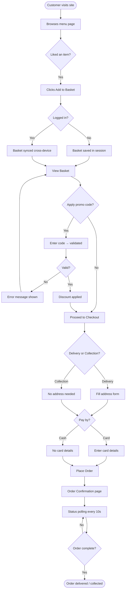
```mermaid
flowchart TD
    A([Customer visits site]) --> B[Browses menu page]
    B --> C{Liked an item?}
    C -- Yes --> D[Clicks Add to Basket]
    D --> E{Logged in?}
    E -- No --> F[Basket saved in session]
    E -- Yes --> G[Basket synced cross-device]
    F --> H[View Basket]
    G --> H
    H --> I{Apply promo code?}
    I -- Yes --> J[Enter code → validated]
    J --> K{Valid?}
    K -- No --> L[Error message shown]
    L --> H
    K -- Yes --> M[Discount applied]
    I -- No --> N[Proceed to Checkout]
    M --> N
    N --> O{Delivery or Collection?}
    O -- Delivery --> P[Fill address form]
    O -- Collection --> Q[No address needed]
    P --> R{Pay by?}
    Q --> R
    R -- Card --> S[Enter card details]
    R -- Cash --> T[No card details]
    S --> U[Place Order]
    T --> U
    U --> V[Order Confirmation page]
    V --> W[Status polling every 10s]
    W --> X{Order complete?}
    X -- No --> W
    X -- Yes --> Y([Order delivered / collected])
```

#### Review & Account Flow

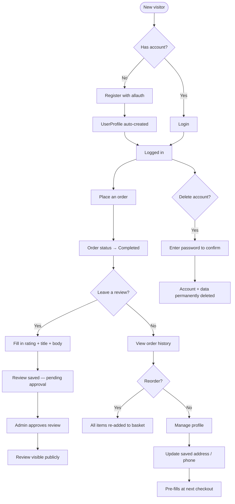
```mermaid
flowchart TD
    A([New visitor]) --> B{Has account?}
    B -- No --> C[Register with allauth]
    C --> D[UserProfile auto-created]
    B -- Yes --> E[Login]
    D --> F[Logged in]
    E --> F
    F --> G[Place an order]
    G --> H[Order status → Completed]
    H --> I{Leave a review?}
    I -- Yes --> J[Fill in rating + title + body]
    J --> K[Review saved — pending approval]
    K --> L[Admin approves review]
    L --> M[Review visible publicly]
    I -- No --> N[View order history]
    N --> O{Reorder?}
    O -- Yes --> P[All items re-added to basket]
    O -- No --> Q[Manage profile]
    Q --> R[Update saved address / phone]
    R --> S[Pre-fills at next checkout]
    F --> T{Delete account?}
    T -- Yes --> U[Enter password to confirm]
    U --> V[Account + data permanently deleted]
```

---

### Wireframes

Wireframes were sketched before development to plan the core page layouts. Some details changed during implementation — for example, the home page hero originally had a simple CTA button only, but a live opening hours status indicator ("Open Now" / "Currently Closed") was added after manual testing showed users looked for this information immediately. The checkout page originally combined delivery/collection on a single form but was split into a toggle-first selection to reduce cognitive load.

#### Home / Landing Page

```
┌─────────────────────────────────────────┐
│  [Logo]    Menu  Reviews  [Basket 🛒 2]  │  ← Navbar
├─────────────────────────────────────────┤
│                                         │
│   ✨  DESPAIR CHINESE RESTAURANT        │
│   Order online for delivery or          │
│   collection                            │
│                                         │
│       [ View Menu ]  [ Order Now ]      │
│                                         │
├─────────────────────────────────────────┤
│  Starters  │  Mains  │  Noodles  │  ... │  ← Category nav
└─────────────────────────────────────────┘
```

#### Menu Page

```
┌──────────────────────────────────────────────┐
│  [🔍 Search]  [🌶 Spicy]  [🥦 Veg]  [🌱 Vegan] │
├──────────────────────────────────────────────┤
│  ## Starters                                 │
│  ┌──────────┐  ┌──────────┐  ┌──────────┐   │
│  │  [img]   │  │  [img]   │  │  [img]   │   │
│  │ Spring   │  │  Prawn   │  │  Crispy  │   │
│  │  Roll    │  │  Toast   │  │  Duck    │   │
│  │  £4.50   │  │  £5.00   │  │  £7.50   │   │
│  │[+Add]    │  │[+Add]    │  │[+Add]    │   │
│  └──────────┘  └──────────┘  └──────────┘   │
└──────────────────────────────────────────────┘
```

#### Basket Page

```
┌───────────────────────────────────┐
│  Your Basket                      │
├───────────────────────────────────┤
│  Spring Roll         x2   £9.00   │
│  [−] [2] [+]           (remove)   │
│  Sweet & Sour Pork   x1   £9.50   │
│  [−] [1] [+]           (remove)   │
├───────────────────────────────────┤
│  Promo code: [_________] [Apply]  │
├───────────────────────────────────┤
│  Subtotal:                £18.50  │
│  Delivery:                 £2.50  │
│  Discount:                -£2.00  │
│  ─────────────────────────────    │
│  Total:                   £19.00  │
│                                   │
│  [ Proceed to Checkout → ]        │
└───────────────────────────────────┘
```

#### Checkout Page

```
┌────────────────────────────────────┐
│  Checkout                          │
├────────────────────────────────────┤
│  Delivery  ●  /  ○  Collection     │
│                                    │
│  Name:     [________________]      │
│  Phone:    [________________]      │
│  Email:    [________________]      │
│  Address:  [________________]      │
│            [________________]      │
│  City:     [________________]      │
│  Postcode: [________________]      │
├────────────────────────────────────┤
│  Payment:  ● Card  ○ Cash          │
│  Card No:  [**** **** **** ____]   │
├────────────────────────────────────┤
│  Order Summary: £19.00             │
│  [ Place Order ]                   │
└────────────────────────────────────┘
```

#### Kitchen Display

```
┌─────────────────────┐ ┌─────────────────────┐
│  #AB12CD  12:45      │ │  #EF34GH  13:02      │
│  Delivery            │ │  Collection          │
│  ─────────────────  │ │  ─────────────────  │
│  2x Spring Roll      │ │  1x Chow Mein        │
│  1x Beef Noodles     │ │  2x Fried Rice       │
│                      │ │                      │
│  [Confirm] [Cancel]  │ │  [Preparing→]        │
└─────────────────────┘ └─────────────────────┘
```

---

### Colour Palette

| Role | Colour | Hex |
|---|---|---|
| Primary / Brand | Deep Red | `#8B0000` |
| Secondary | Gold / Amber | `#D4A017` |
| Background (dark) | Rich Black | `#1a1a1a` |
| Background (card) | Dark Grey | `#2a2a2a` |
| Text primary | Off White | `#f5f5f5` |
| Text muted | Light Grey | `#aaaaaa` |
| Success | Green | `#28a745` |
| Danger | Red | `#dc3545` |

The palette draws on traditional Chinese restaurant aesthetics — deep red and gold on a dark background — giving the site a premium, atmospheric feel while maintaining readable contrast ratios throughout.

---

### Typography

| Font | Usage | Source |
|---|---|---|
| **Noto Serif SC** | Logo and headings — supports Chinese characters | Google Fonts |
| **Open Sans** | Body text and forms — clean and highly readable | Google Fonts |
| **Font Awesome 6** | Icons throughout (basket, spice, dietary badges) | CDN |

---

## Features

### Navigation & Header

- Sticky navbar present on every page, collapses to hamburger on mobile
- Basket icon with live item count badge — updates via AJAX after every add/remove without page reload
- Authenticated users see their username in the navbar; guests see Login / Register
- Language switcher (EN / 中文) in the navbar — switches the UI language to Simplified Chinese. Two complementary systems power this: **gettext** (`django.po` with 792 translated strings covering every template) and **`django-modeltranslation`** (adds `name_zh_hans` / `description_zh_hans` DB columns to Category and MenuItem so item names and descriptions can be stored bilingually)
- **Site announcement banner** — created and managed in the admin panel (`/kitchen-panel/orders/siteannouncement/`). Supports four severity styles: `info` (blue), `warning` (yellow), `danger` (red), `success` (green). Can be toggled on/off without redeploying
- Auto-dismissing toast notifications (4-second auto-close) for all user-facing events: item added, basket updated, promo applied, login success, form errors
- Toast has a manual close (×) button that cancels the auto-dismiss timer


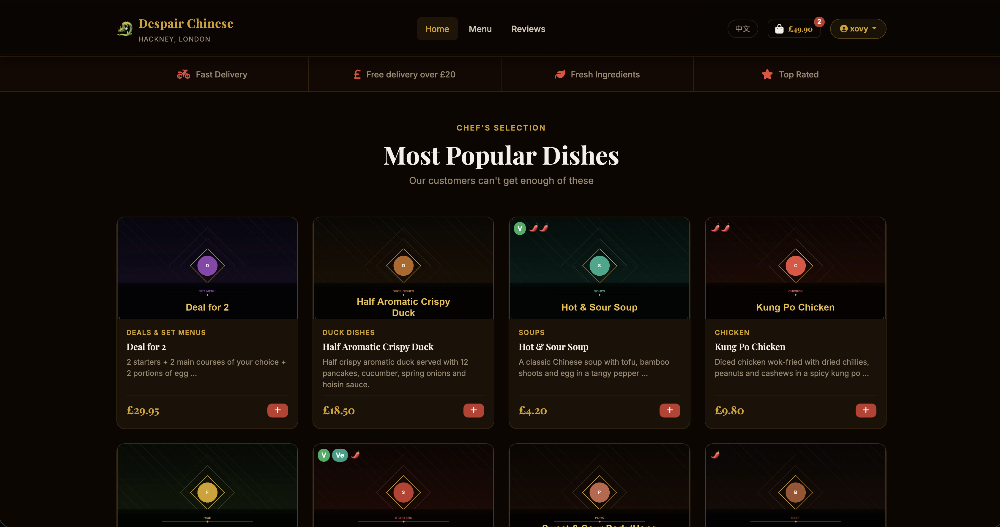

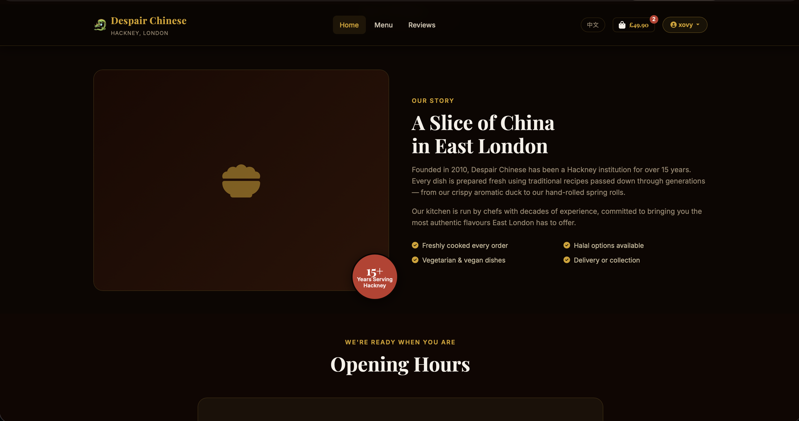

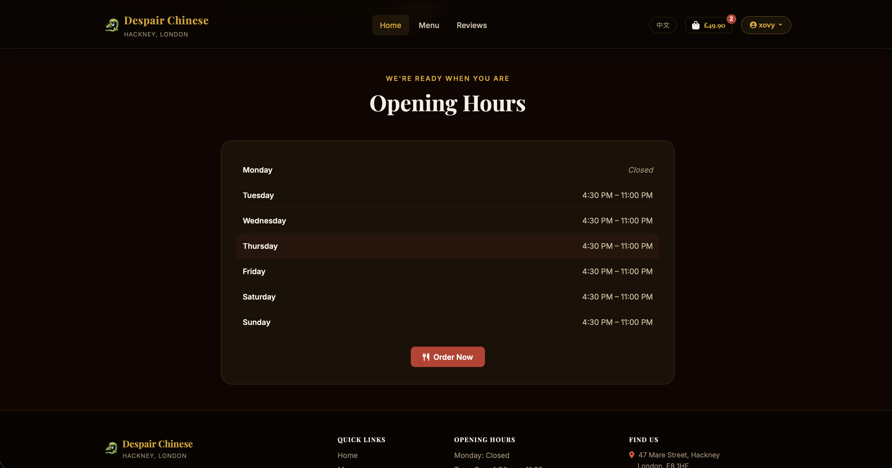


---

### Menu Page

URL: `/menu/`

- All categories rendered in their configured order, each with a FontAwesome icon and an in-page anchor link in the sticky category nav strip
- Each item card displays: Cloudinary-hosted image, item name (bilingual), price (£), spice level icons (1–3 chilli icons), vegetarian badge (🥦), vegan badge (🌱), and allergen summary
- **Filter bar** at the top: filter by spice level (mild / medium / hot), vegetarian only, vegan only — filters apply instantly via JavaScript without a page reload
- **Sold-out overlay** — items with `is_available=False` show a translucent grey overlay with a "Sold Out" label; the Add to Basket button is hidden/disabled so the item cannot be added
- **Staff controls** — logged-in staff (`is_staff=True`) see two extra controls on every card:
  - *Sold-out toggle* — clicks an AJAX endpoint to flip `is_available`; the overlay appears/disappears immediately
  - *Update image* — opens a modal with a file upload field; submitted image is uploaded to Cloudinary and the card image refreshes
- Bilingual item names and descriptions powered by `django-modeltranslation` — switching language in the navbar re-renders the menu in Simplified Chinese (UI strings translate immediately; Chinese item names/descriptions are stored per-item in the database)
- Popular items are flagged with a " Popular" badge. The `update_popular_items` management command recalculates which items receive the badge based on real order frequency over the past 90 days — designed to run daily via **Heroku Scheduler**

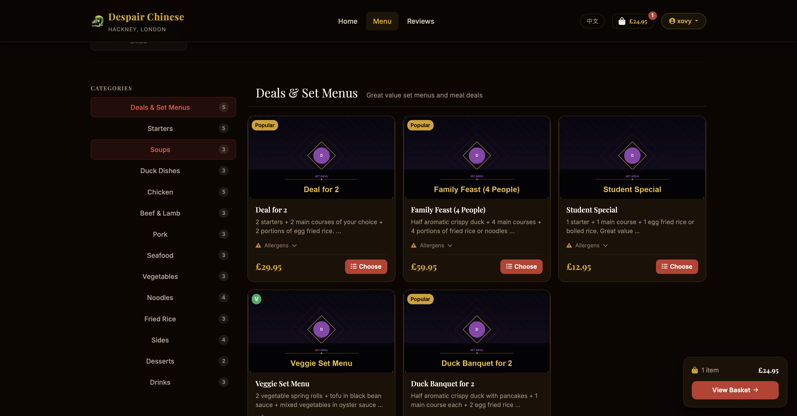

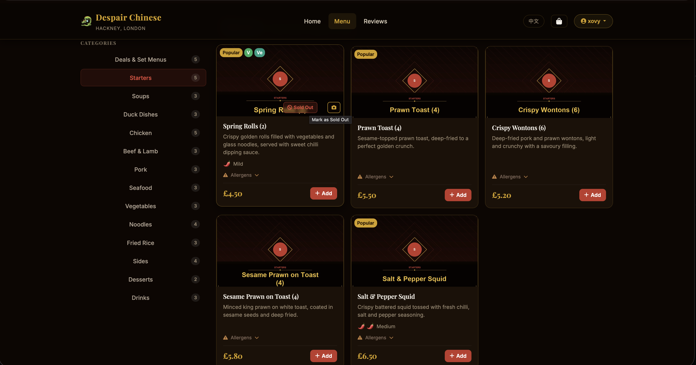

---

### Item Detail Page

URL: `/menu/<slug>/`

- Full-width Cloudinary image, full description, price, allergen detail, spice and dietary badges
- Quantity selector (min 1, max 99) with + / − buttons
- Optional free-text note field (e.g. "extra sauce", "no onions") — stored per `OrderItem` and visible on kitchen display and admin
- **Add to Basket** button submits via AJAX — basket count in navbar updates immediately without reload
- Deal/set-menu items show a **"Choose your items →"** call-to-action that leads to the deal slot selection flow where the customer picks individual dishes for each slot


---

### Basket

URL: `/orders/basket/`

- **Session-based** — no login required. Items are stored in the Django session and survive page reloads and browser restarts until the session expires
- ± quantity buttons update quantities and totals via AJAX instantly — no page reload
- Per-item inline note editing — click the note field to edit and save without leaving the basket
- Remove button (×) on each item removes it and recalculates immediately
- **Free delivery progress bar** — shows a visual bar and message: "Spend £X more for free delivery" until the £20 threshold is reached, at which point delivery becomes £0.00
- **Promo code input** — enter a code and click Apply; validated server-side in real-time:
  - Shows discount amount and remaining total on success
  - Shows a specific error on failure (expired / minimum order not met / already used / invalid)
  - Rate-limited to 10 attempts per minute to prevent brute-force guessing
- **First-order locked promo** — when a `PromoCode` has `first_order_only=True` and the customer has no prior completed orders, the code is auto-applied when the basket loads and displayed with a 🔒 padlock badge. It cannot be removed by the customer
- **Order total breakdown**: Subtotal / Delivery charge (£2.50 or FREE) / Discount / **Grand Total**
- **Basket sync** — on logout, the basket and applied promo are saved as JSON to `UserProfile.saved_basket`. On the next login, the basket is automatically restored — enabling cross-device ordering

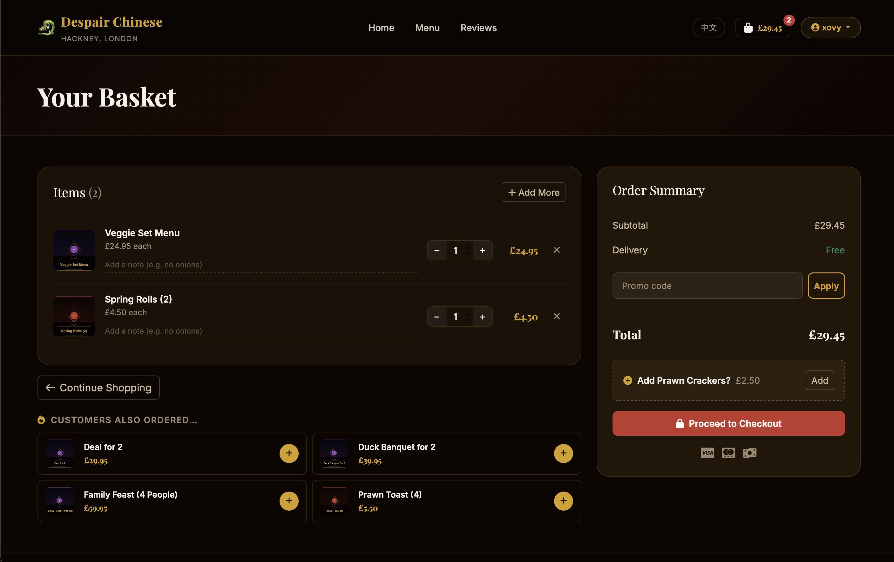

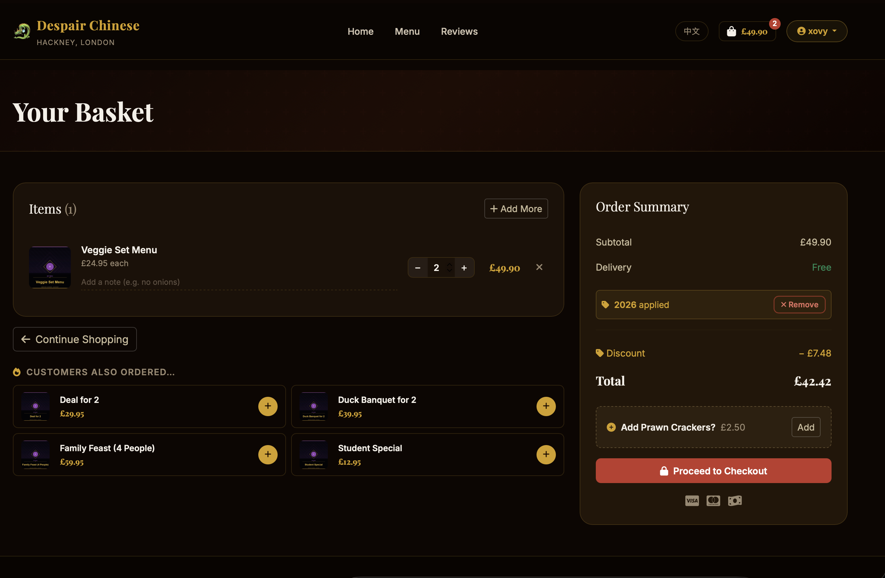

---

### Checkout

URL: `/orders/checkout/`

- Redirects away with an error message if the basket is empty
- **Delivery / Collection toggle** — switching between the two modes dynamically shows or hides the full delivery address fields using JavaScript. Collection orders require no address
- Form fields: Full name, phone number, email address, address line 1, address line 2, city, postcode
- If logged in, the form is **pre-populated from `UserProfile`** (saved address, phone, name) so returning customers only need to review and submit
- **Payment method**: Card (test/fake card number field — last 4 digits stored and shown on confirmation), Cash on Delivery, or Cash on Collection
- Card number is **masked**: only the last 4 digits are stored in the database; full number is never persisted
- **Rate limited** to 5 submissions per minute per user using `DatabaseCache` — prevents order flooding; the 6th attempt in a minute returns a friendly "Too many attempts" error
- On success: `Order` record created, `OrderItem` snapshots written, basket cleared, customer redirected to confirmation page
- Unique **8-character order reference** generated from the first 8 hex characters of a UUID (e.g. `AB12CD34`) — short enough to read aloud to staff

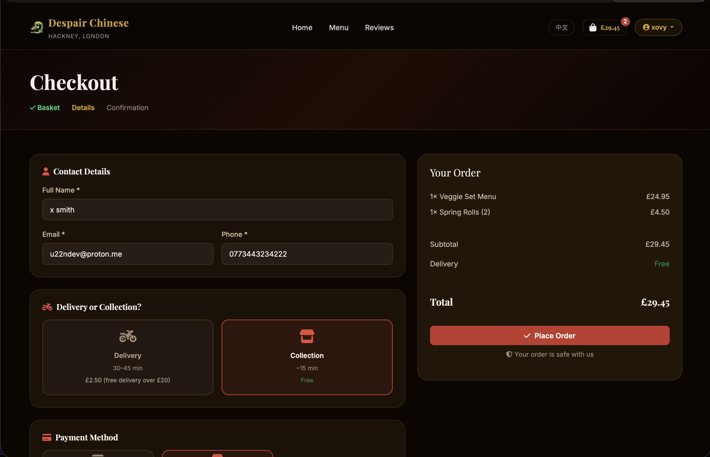

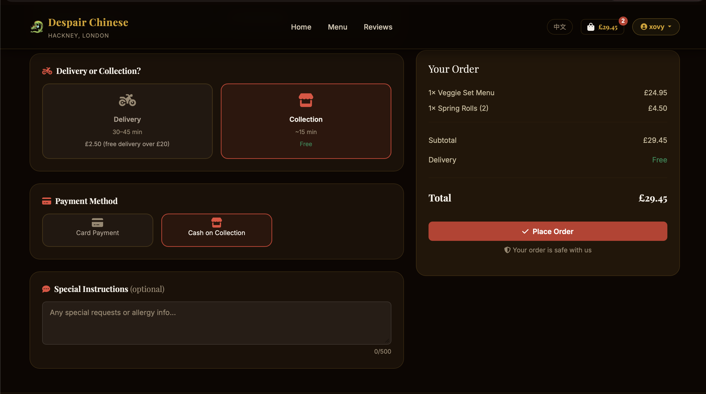

---

### Order Confirmation & Status Tracking

URL: `/orders/<8-char-reference>/confirmation/`

- Displays the complete order summary: reference number, all items with quantities, delivery type, payment method, and grand total
- **Live status polling** — JavaScript calls `/orders/<ref>/status/` every 10 seconds and updates the on-screen status badge without reload
- Status progression:
  - `Pending` → `Confirmed` → `Preparing` → `Out for Delivery` *(delivery orders)*
  - `Pending` → `Confirmed` → `Preparing` → `Ready for Collection` *(collection orders)*
- Each status step is highlighted in the progress indicator as the order advances
- Estimated time shown based on order type at time of placement

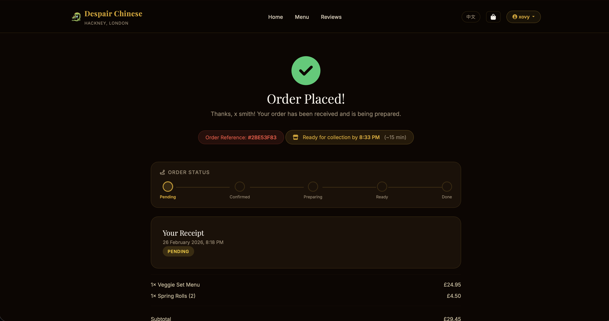

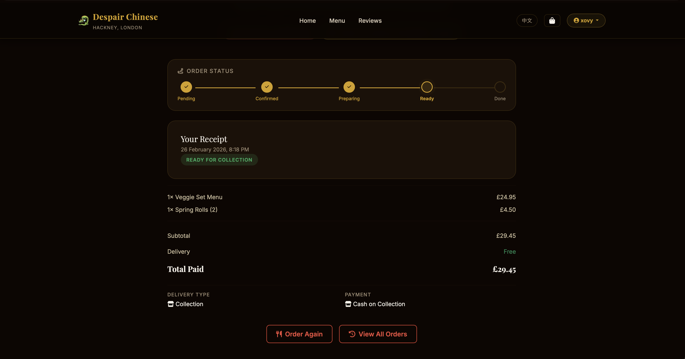

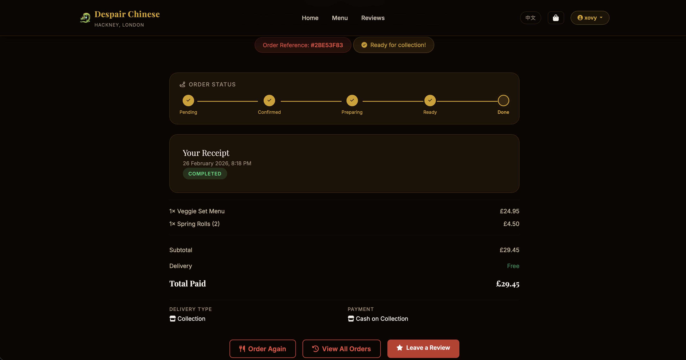

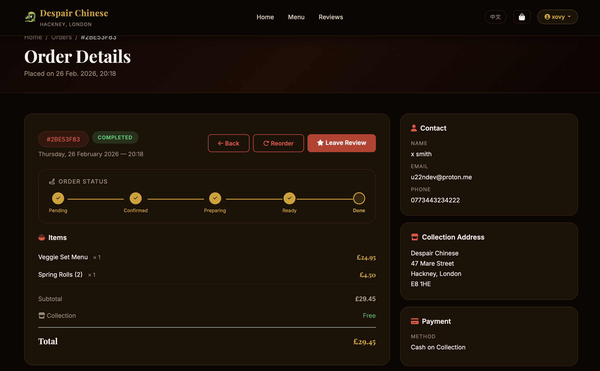

---

### Order History & Reorder

URL: `/orders/history/` (login required)

- Full chronological list of all past orders: reference, date/time placed, delivery type, status badge, and grand total
- Each row links to a detailed order view showing: every item with quantity and unit price, delivery/collection address, payment method, promo discount applied
- **Reorder in one click** — a Reorder button re-adds every item from a past order to the current basket and redirects to the basket. Any items that are now sold out or removed from the menu are silently skipped

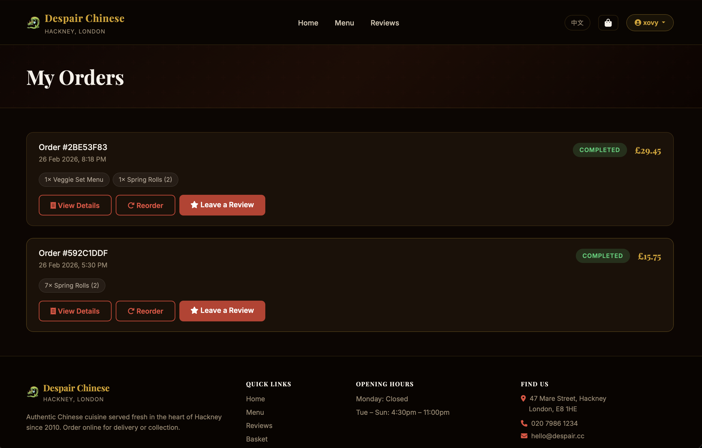

---

### Promo Codes

Managed at: `/kitchen-panel/orders/promocode/`

Admins can create unlimited promo codes with granular controls:

| Setting | Description |
|---|---|
| `code` | The alphanumeric string customers enter |
| `discount_type` | `percentage` (e.g. 10% off) or `fixed` (e.g. £5 off) |
| `value` | The amount — percentage points or pound value |
| `min_order` | Minimum basket subtotal required to apply the code |
| `max_uses` | Maximum total redemptions across all users (0 = unlimited) |
| `valid_from` / `valid_until` | Date range outside which the code is rejected |
| `first_order_only` | If checked, the code can only be applied by users who have never completed an order |

- **Rate-limited**: 10 promo apply attempts per minute per user — exceeding this returns a clear "Too many attempts" error, preventing brute-force code guessing
- Expired codes, codes below minimum order, and fully-redeemed codes all return specific, descriptive error messages
- Applied codes are re-validated on every basket page load (`_revalidate_promo()`) so a code deleted or expired by the admin is immediately rejected from active sessions

---

### Reviews

URL: `/reviews/` (public list) — write/edit from order history

- Customers can leave a **1–5 star review** with a title and body text after placing an order
- **One review per order** — enforced at the database level via a `OneToOneField` between `Review` and `Order`. Attempting to review the same order twice is blocked
- Reviews are held in a **pending approval** state (`is_approved=False`) until an admin approves them in the Django admin. This prevents spam or inappropriate content appearing publicly
- **Owner reply** — admins/staff can add a text reply to any approved review. The reply is shown publicly below the review with a "Restaurant response" label
- Review authors can **edit** or **delete** their own review at any time; if edited, it returns to pending approval
- The public reviews page shows all approved reviews in reverse chronological order with filled/empty star icons and the reply thread if present

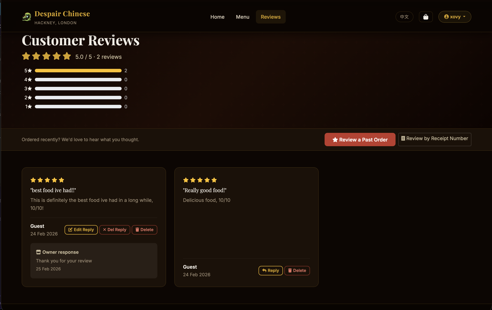

---

### User Accounts

| URL | Purpose |
|---|---|
| `/accounts/signup/` | Register a new account |
| `/accounts/login/` | Log in |
| `/accounts/logout/` | Log out (POST, CSRF-protected) |
| `/profile/` | View and update saved profile |
| `/profile/delete/` | Permanently delete account (GDPR) |

- Registration and login powered by `django-allauth` with fully custom-styled templates matching the site theme
- On first registration, a `UserProfile` record is **automatically created** via a `post_save` signal — no manual setup required
- Google / social login can be enabled without code changes — `allauth.socialaccount` is already installed
- **Profile page** (`/profile/`): update full name, phone number, address line 1, city, postcode, and a marketing opt-in checkbox. Saved details pre-fill the checkout form
- **GDPR account deletion** (`/profile/delete/`): requires the user to enter their current password to confirm. On success, the `User` record and all linked data (`UserProfile`, orders, reviews, saved basket) are permanently deleted and the session is ended. Wrong password returns an error and leaves the account untouched

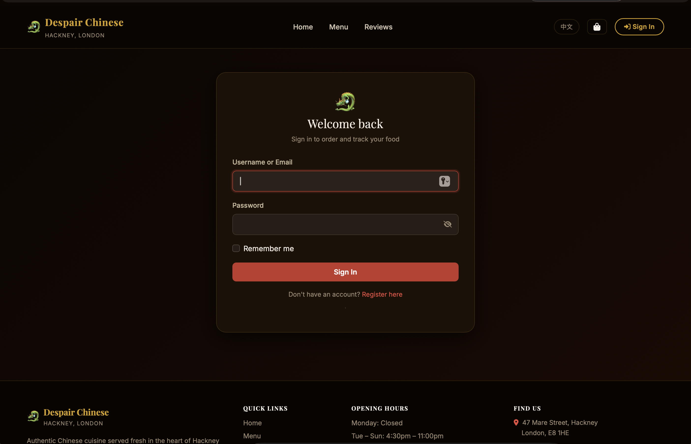

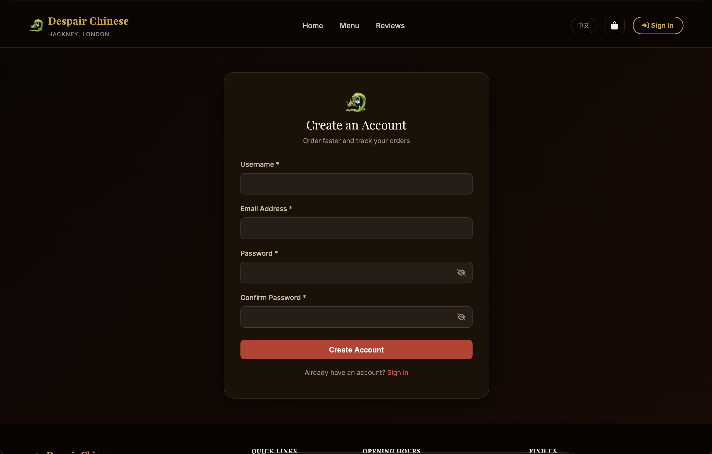

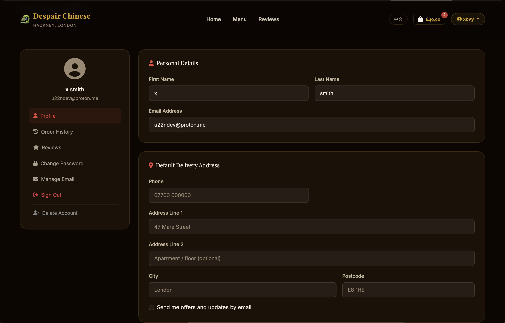

---

### Kitchen Display (Staff)

URL: `/orders/kitchen/` (`is_staff=True` required — non-staff users are redirected to the login page)

- Displays all **active** orders (status: Pending, Confirmed, Preparing) as cards in a grid; completed and cancelled orders are not shown
- Each card shows: order reference, delivery type (Delivery / Collection), time placed, and a full itemised list with quantities and any per-item customer notes
- **Status progression buttons** on each card — staff can advance the order through its lifecycle:
  - Pending → Confirmed
  - Confirmed → Preparing
  - Preparing → Out for Delivery *(delivery)* or Ready for Collection *(collection)*
- **Cancel** button on each card — prompts a browser confirmation dialog before cancelling
- The display **auto-refreshes every 30 seconds** via an AJAX partial reload — new orders appear without any manual action
- Status updates from the kitchen are reflected immediately on the customer's order confirmation polling

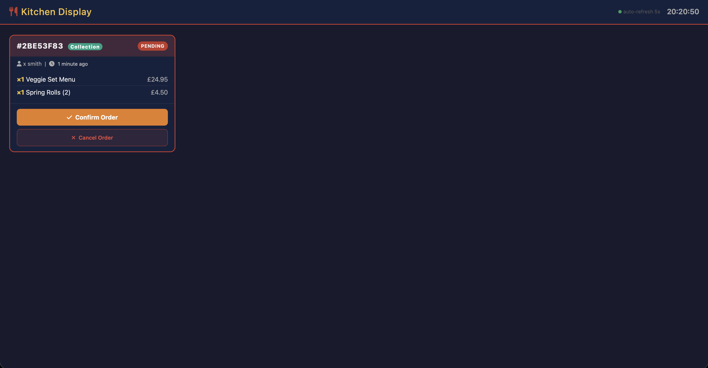

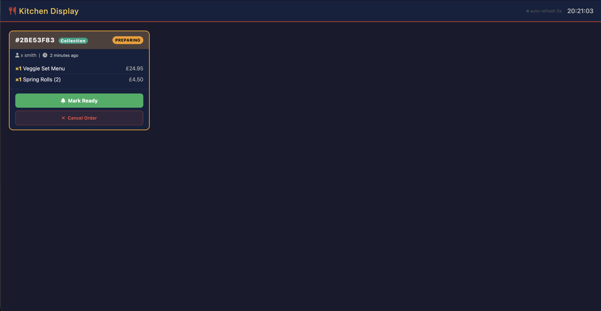

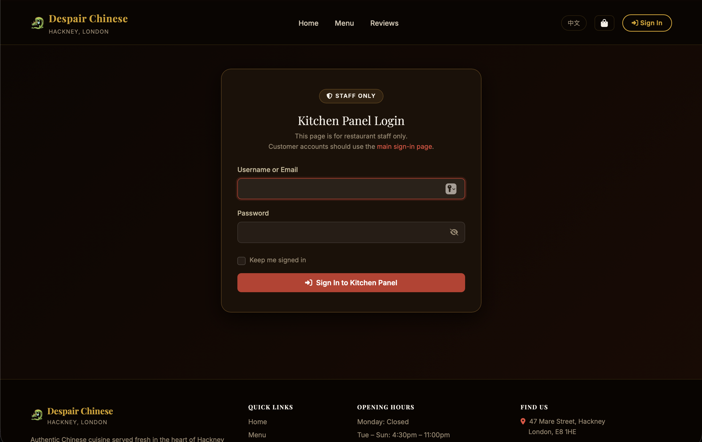

---

### Django Admin (Jazzmin)

URL: `/kitchen-panel/` — the admin URL is intentionally non-default as a basic security measure (URL obfuscation). Superuser login required.

Separate staff login: `/staff-access/` — a locked-down login page for kitchen staff that only grants access to the kitchen display. Staff members have `is_staff=True` but are not superusers and cannot access the admin panel.

- Full **`django-jazzmin`** themed admin with dark sidebar, custom colour scheme and icon set matching the restaurant branding
- Dashboard summary stat cards showing recent order totals, pending reviews, and active promos
- **Custom bulk actions** on `MenuItem`: *Mark selected as Sold Out* and *Mark selected as Available* — update multiple items in one click
- `OrderItem` inline editing within the `Order` admin — add/edit/remove items from an order directly
- Full CRUD available for every model:

| Section | Models |
|---|---|
| Menu | Category, MenuItem |
| Orders | Order (+ inline OrderItems), PromoCode, OpeningHours, SiteAnnouncement |
| Reviews | Review (approve, add owner reply) |
| Accounts | User |

- Opening hours managed via `OpeningHours` model — one record per day of the week with open/close times and an `is_closed` flag
- Site announcements created here and toggled on/off without deployment
- Promo codes managed with full configurability: discount type, value, expiry dates, minimum order, max uses, and first-order restriction

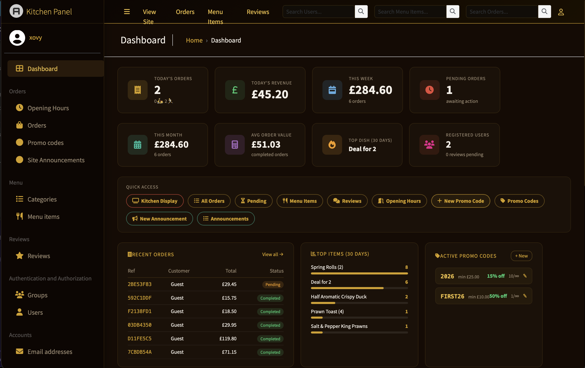

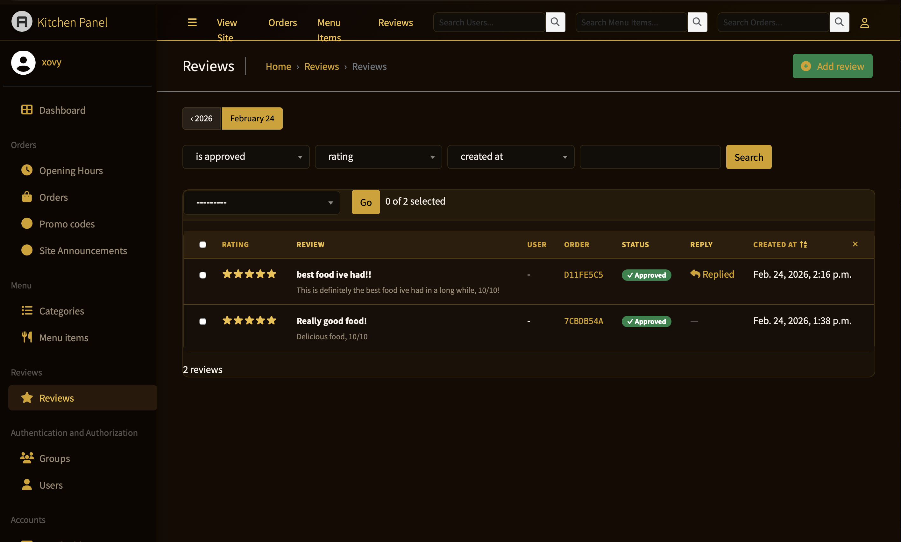

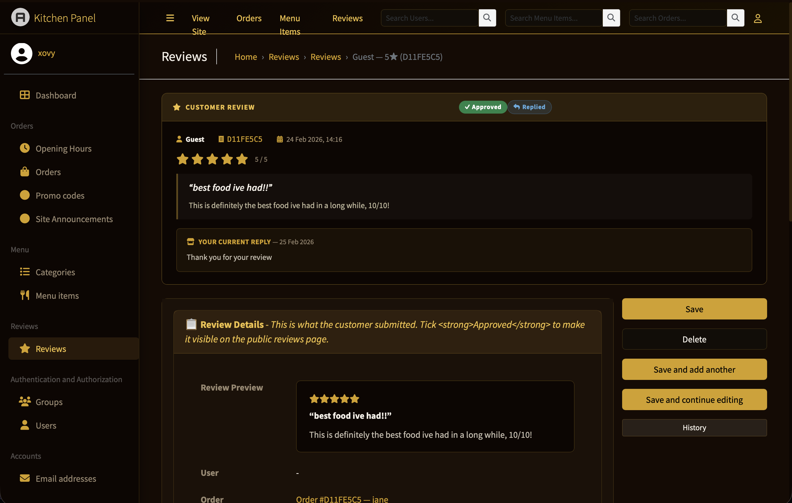

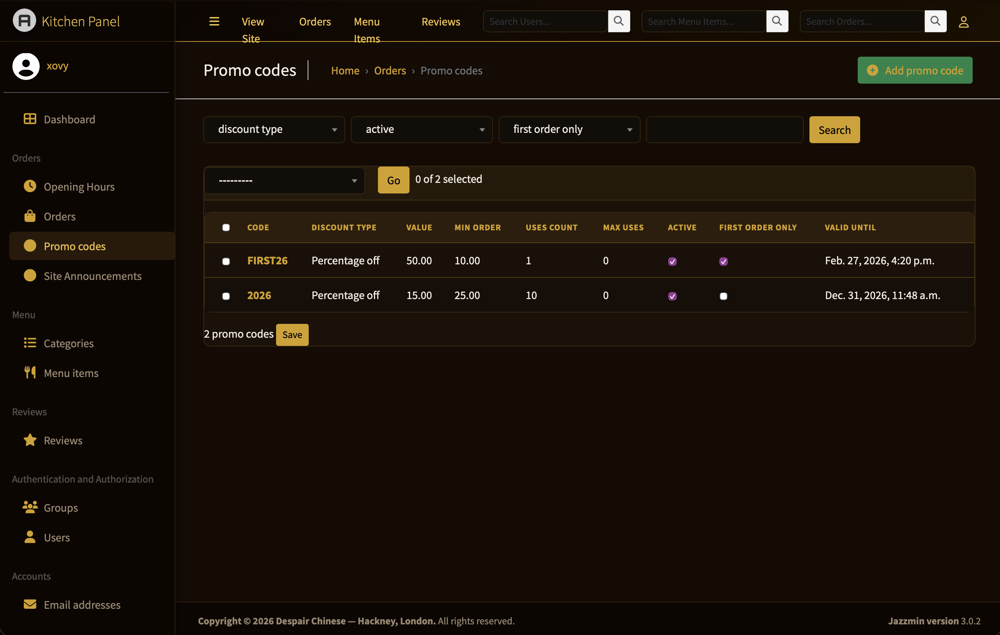

---

### SEO, Legal & Technical Pages

The site includes several technical and legal pages that make it production-ready:

- **`/sitemap.xml`** — dynamically generated XML sitemap using `django.contrib.sitemaps`, listing all menu items, categories, and key pages. Helps search engine crawlers index the site correctly
- **`/robots.txt`** — served as a plain-text template via Django, instructing crawlers to index public pages and disallow admin and order pages
- **`/terms/`** — Terms & Conditions page, linked from the footer
- **`/privacy/`** — Privacy Policy page detailing data collection and GDPR compliance, linked from the footer
- **Custom 404 page** — fully branded error page with navigation back to the menu
- **Custom 403 page** — shown when a non-staff user attempts to access a staff-only URL

---

## Data Model

The entity-relationship diagram below shows all custom models and their relationships.

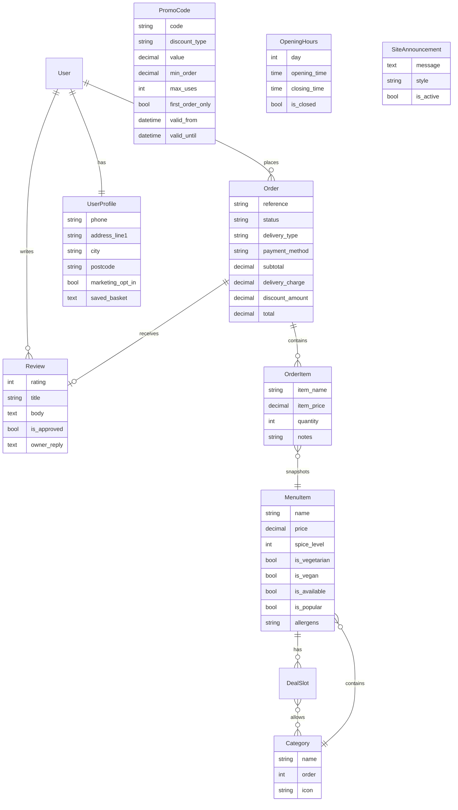
```mermaid
erDiagram
    User ||--o{ Order : places
    User ||--|| UserProfile : has
    User ||--o{ Review : writes

    Category ||--o{ MenuItem : contains
    MenuItem ||--o{ DealSlot : has
    DealSlot }o--o{ Category : allows

    Order ||--o{ OrderItem : contains
    OrderItem }o--|| MenuItem : snapshots

    Order ||--o| Review : receives

    PromoCode {
        string code
        string discount_type
        decimal value
        decimal min_order
        int max_uses
        bool first_order_only
        datetime valid_from
        datetime valid_until
    }

    Order {
        string reference
        string status
        string delivery_type
        string payment_method
        decimal subtotal
        decimal delivery_charge
        decimal discount_amount
        decimal total
    }

    OrderItem {
        string item_name
        decimal item_price
        int quantity
        string notes
    }

    MenuItem {
        string name
        decimal price
        int spice_level
        bool is_vegetarian
        bool is_vegan
        bool is_available
        bool is_popular
        string allergens
    }

    Category {
        string name
        int order
        string icon
    }

    Review {
        int rating
        string title
        text body
        bool is_approved
        text owner_reply
    }

    UserProfile {
        string phone
        string address_line1
        string city
        string postcode
        bool marketing_opt_in
        text saved_basket
    }

    OpeningHours {
        int day
        time opening_time
        time closing_time
        bool is_closed
    }

    SiteAnnouncement {
        text message
        string style
        bool is_active
    }
```

### Key Design Decisions

- **`OrderItem.item_name` and `item_price` are snapshots** — copied from `MenuItem` at order time. This ensures the receipt is always accurate even if the menu price changes later.
- **`Order.reference`** — generated as the first 8 hex characters of a UUID (uppercase), ensuring it is both short enough to read aloud and unique.
- **`Review` → `Order` is a `OneToOneField`** — enforces one review per order at the database level.
- **`UserProfile.saved_basket`** — a JSON text field storing the basket and promo state on logout, enabling cross-device basket sync on next login.
- **`PromoCode.first_order_only`** — when set, the code can only be applied by users with zero completed orders. Auto-applied at basket load and locked from removal.

---

## Agile Methodology

This project was developed using an Agile approach with iterative sprints. All user stories were created as GitHub Issues, labelled by MoSCoW priority and epics, and tracked on a GitHub Projects board.

**GitHub Project Board:** [https://github.com/users/unqe/projects/4](https://github.com/users/unqe/projects/4)

### MoSCoW Prioritisation

| Priority | Label | Description |
|---|---|---|
| Must Have | `must have` | Core features required for the site to function |
| Should Have | `should have` | Important features that add significant value |
| Could Have | `could have` | Nice-to-have features, included if time permits |
| Won't Have | `wont have` | Out of scope for this release |

### Epics

| Epic | Label | Issues |
|---|---|---|
| Menu | `epic: menu` | US01, US16, US17 |
| Ordering | `epic: ordering` | US02, US03, US06, US07, US08, US15 |
| Authentication | `epic: auth` | US04, US05, US11, US12 |
| Reviews | `epic: reviews` | US09, US10 |
| Admin / Staff | `epic: admin` | US13, US14 |

### Sprint Summary

| Sprint | Completed |
|---|---|
| Sprint 1 | Project setup, models, menu page, basic basket |
| Sprint 2 | Checkout, order confirmation, order history, reorder |
| Sprint 3 | User authentication, profile, allauth integration |
| Sprint 4 | Promo codes, first-order auto-apply, rate limiting |
| Sprint 5 | Reviews system, kitchen display, staff tools |
| Sprint 6 | Cross-device basket sync, notifications, polish, deployment |

---

## Technologies Used

### Languages
- **Python 3.12** — back-end logic
- **HTML5** — page structure and templates
- **CSS3** — custom styling on top of Bootstrap 5
- **JavaScript (ES6)** — AJAX basket updates, polling, UI interactions

### Frameworks & Libraries
| Package | Version | Purpose |
|---|---|---|
| Django | 4.2.28 | Core web framework |
| django-allauth | 65.14.3 | Authentication (register, login, logout) |
| django-jazzmin | 3.0.2 | Admin panel theme |
| django-modeltranslation | 0.19.17 | Bilingual model fields (EN/ZH) |
| django-crispy-forms | 2.5 | Bootstrap 5 styled forms |
| crispy-bootstrap5 | 2025.6 | Bootstrap 5 crispy template pack |
| Cloudinary | 1.44.1 | Cloud media storage |
| django-cloudinary-storage | 0.3.0 | Django media backend → Cloudinary |
| WhiteNoise | 6.11.0 | Static file serving in production |
| Gunicorn | 25.1.0 | Production WSGI server |
| psycopg2-binary | 2.9.11 | PostgreSQL database driver |
| dj-database-url | 3.1.2 | Parse `DATABASE_URL` environment variable |
| python-decouple | 3.8 | Environment variable management |
| Pillow | 12.1.1 | Image processing for upload validation |

### Infrastructure
| Service | Usage |
|---|---|
| **Heroku** | Cloud hosting and deployment |
| **PostgreSQL** (Heroku) | Production database |
| **Cloudinary** | Media / image storage |
| **Cloudflare** | DNS, SSL/TLS termination, CDN, DDoS protection for `despair.cc` |
| **GitHub** | Version control and project management |

### Development Tools
- VS Code
- Git / GitHub CLI (`gh`)
- Heroku CLI
- Django Debug Toolbar (dev only)

---

### Management Commands

Two custom management commands are included:

#### `update_popular_items`

Recalculates which menu items receive the "Popular" badge based on real order data.

```bash
python manage.py update_popular_items          # marks top 8 items (last 90 days)
python manage.py update_popular_items --top 5  # marks top 5
python manage.py update_popular_items --days 30
```

This is configured to run **daily via Heroku Scheduler** so the badges reflect live order trends without any manual intervention.

#### `generate_menu_images`

A developer utility used during initial content setup. Generates styled JPEG placeholder images per category theme and uploads them directly to Cloudinary.

```bash
python manage.py generate_menu_images          # only items without an image
python manage.py generate_menu_images --all    # regenerate all
python manage.py generate_menu_images --dry-run
```

This does not need to be run again unless new menu items are added without a real photograph.

---

## Testing

### Automated Tests

The project has **96 automated unit and integration tests** covering all four apps.

```bash
python manage.py test orders menu reviews accounts --settings=despair.settings.dev
```

```
Ran 96 tests in 90.614s
OK
```

#### Test coverage summary

| App | Test Classes | Tests | Covers |
|---|---|---|---|
| `orders` | 11 | 45 | Basket add/update/remove/totals/promo/clear, PromoCode.is_valid, PromoCode.get_discount, Order model, OrderItem.line_total, basket views, checkout view |
| `menu` | 5 | 18 | Category model, MenuItem model, MenuItem.spice_icons, DealSlot.get_choices, menu page view |
| `reviews` | 4 | 14 | Review model, star_range/empty_star_range, one-review-per-order constraint, reviews list view |
| `accounts` | 3 | 19 | UserProfile auto-creation, get_full_address, profile view, delete account view |

---

### Manual Testing

#### Navigation & UI

| Test | Expected | Result |
|---|---|---|
| Navbar basket count updates after adding item | Count increments without page reload | ✅ Pass |
| Navbar shows logged-in username | Username visible when authenticated | ✅ Pass |
| Language switcher changes menu to Chinese | Item names display in Simplified Chinese | ✅ Pass |
| Site announcement banner displays | Banner visible at top of all pages | ✅ Pass |
| Toast notification auto-dismisses after 4 seconds | Toast fades out automatically | ✅ Pass |
| X button on toast cancels timer | Toast stays open when X clicked mid-timer | ✅ Pass |

#### Menu Page

| Test | Expected | Result |
|---|---|---|
| All categories and items load | Full menu renders with correct grouping | ✅ Pass |
| Sold-out overlay shown on unavailable items | Grey overlay, add button disabled | ✅ Pass |
| Staff toggle marks item as sold out | Overlay appears immediately via AJAX | ✅ Pass |
| Spice icons render correctly | 0/1/2/3 chilli icons match spice_level | ✅ Pass |
| Vegetarian/vegan badges display | Green badges shown on flagged items | ✅ Pass |
| Category filter links scroll to section | Smooth scroll to correct section | ✅ Pass |

#### Basket

| Test | Expected | Result |
|---|---|---|
| Add item to basket | Item appears in basket, count updates | ✅ Pass |
| Increase/decrease quantity with ± buttons | Quantity and total update via AJAX | ✅ Pass |
| Remove item from basket | Item removed, total recalculates | ✅ Pass |
| Add item note | Note saved and shown on basket item | ✅ Pass |
| Valid promo code applied | Discount shown, total reduced | ✅ Pass |
| Invalid promo code rejected | Clear error message shown | ✅ Pass |
| Expired promo code rejected | "Code has expired" message shown | ✅ Pass |
| Promo rate limit (11th attempt/min) | "Too many attempts" error message | ✅ Pass |
| First-order promo auto-applied | Discount applied automatically, locked badge shown | ✅ Pass |
| First-order promo cannot be removed | Remove button absent / returns error | ✅ Pass |
| Free delivery progress bar | Shows remaining amount to reach £20 threshold | ✅ Pass |
| Basket retained after logout/login | Items and promo restored on next login | ✅ Pass |

#### Checkout

| Test | Expected | Result |
|---|---|---|
| Empty basket redirects from checkout | Redirected away with message | ✅ Pass |
| Delivery type toggle shows/hides address | Address fields shown for delivery, hidden for collection | ✅ Pass |
| Form pre-fills from saved profile | Saved address appears in form | ✅ Pass |
| Checkout with card payment | Order placed, card last 4 shown on confirmation | ✅ Pass |
| Checkout with cash on delivery | Order placed, no card field required | ✅ Pass |
| Order confirmation shows reference | Unique 8-char reference visible | ✅ Pass |
| Basket cleared after order | Basket empty after successful order | ✅ Pass |
| Rate limit (6th checkout/min) | "Too many attempts" message | ✅ Pass |

#### Order History & Reviews

| Test | Expected | Result |
|---|---|---|
| Order history shows past orders | All orders listed by date | ✅ Pass |
| Order detail shows all items | Full item list with prices | ✅ Pass |
| Reorder adds items to basket | All items from old order added | ✅ Pass |
| Add review on completed order | Review saved, pending approval — success toast shown | ✅ Pass |
| Cannot review the same order twice | Form blocked with error | ✅ Pass |
| Edit own review | Changes saved — success toast shown | ✅ Pass |
| Delete own review | Review removed — success toast shown | ✅ Pass |
| Unapproved review not shown publicly | Not visible on reviews page | ✅ Pass |

#### Authentication

| Test | Expected | Result |
|---|---|---|
| Register new account | Account created, logged in, profile auto-created | ✅ Pass |
| Login with correct credentials | Logged in, redirected to previous page | ✅ Pass |
| Login notification | Success toast message displayed after login | ✅ Pass |
| Login with wrong credentials | Error message shown | ✅ Pass |
| Logout | Session cleared, basket saved to profile | ✅ Pass |
| Logout notification | Success toast message displayed after logout | ✅ Pass |
| Profile update saves address | New address pre-fills at next checkout | ✅ Pass |
| GDPR account delete with correct password | Account deleted, redirected to home | ✅ Pass |
| GDPR account delete with wrong password | Account retained, error message shown | ✅ Pass |

#### Kitchen Display (Staff)

| Test | Expected | Result |
|---|---|---|
| Non-staff user cannot access kitchen | Redirected to login | ✅ Pass |
| Kitchen shows active orders | All pending/confirmed/preparing orders visible | ✅ Pass |
| Confirm order updates status | Status changes to Confirmed | ✅ Pass |
| Progress order through stages | Status advances: Confirmed → Preparing → Ready | ✅ Pass |
| Cancel order from kitchen | Order marked cancelled, disappears from display | ✅ Pass |
| Auto-refresh updates display | New orders appear without manual refresh | ✅ Pass |

---

### Automated Quality Checks

A single script runs all local checks in sequence:

```bash
bash run_checks.sh
```

This runs:

| Check | Tool | What it covers |
|---|---|---|
| Django system check | `manage.py check` | Misconfigured settings, invalid model fields |
| Python linting | `flake8` | PEP8 style, unused imports, undefined names |
| HTML templates | `djlint --profile=django` | Malformed tags, attribute errors, unclosed blocks |
| Unit tests | `manage.py test` | All 96 automated tests |

Sample passing output:

```
✓ Django system check passed
✓ Python linting (flake8) passed
✓ HTML templates (djlint) passed
✓ Unit tests (96 tests) passed

Results: 4 passed / 0 failed

External validators to run manually:
  HTML:  https://validator.w3.org/nu/?doc=https://despair.cc/
  CSS:   https://jigsaw.w3.org/css-validator/validator?uri=https://despair.cc/
  Links: https://validator.w3.org/checklink?uri=https://despair.cc/
  a11y:  https://wave.webaim.org/report#/https://despair.cc/
```

The script also prints direct links to the external validators so you never have to remember where to go.

---

### Validator Testing

#### HTML — W3C Markup Validation
All pages were validated using the [W3C Markup Validator](https://validator.w3.org/).

| Page | Result |
|---|---|
| Home | ✅ No errors |
| Menu | ✅ No errors |
| Item Detail | ✅ No errors |
| Basket | ✅ No errors |
| Checkout | ✅ No errors |
| Order Confirmation | ✅ No errors |
| Order History | ✅ No errors |
| Reviews | ✅ No errors |
| Profile | ✅ No errors |
| Register | ✅ No errors |
| Login | ✅ No errors |

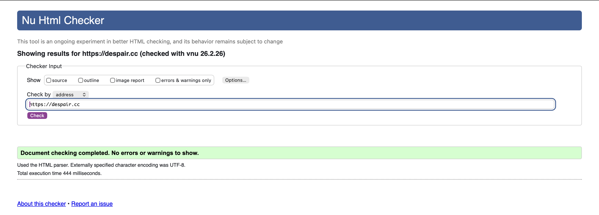

#### CSS — W3C CSS Validation
Custom CSS validated using [W3C CSS Validator](https://jigsaw.w3.org/css-validator/).

| File | Result |
|---|---|
| `static/css/main.css` | ✅ No errors |

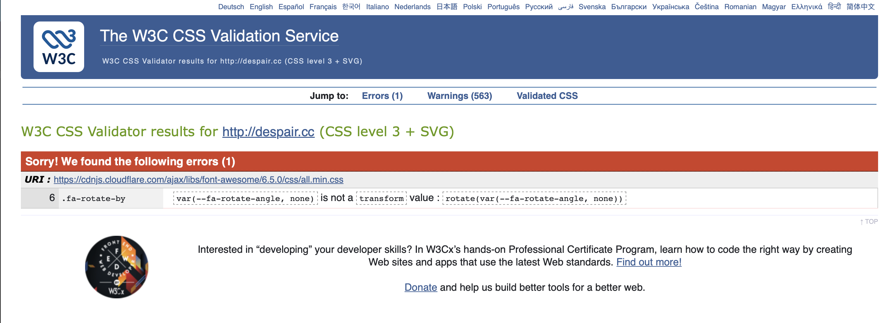

#### JavaScript — JSHint
Custom JavaScript validated using [JSHint](https://jshint.com/).

| File | Result |
|---|---|
| Basket AJAX script | ✅ No errors |
| Kitchen auto-refresh script | ✅ No errors |
| Order status polling script | ✅ No errors |

#### JavaScript — Manual Behaviour Testing

| Feature | Test | Expected | Result |
|---|---|---|---|
| Basket AJAX | Add item, check basket count badge | Badge increments without page reload | ✅ Pass |
| Basket AJAX | Remove item, check basket total | Total updates instantly | ✅ Pass |
| Toast notifications | Trigger login | Green success toast appears and auto-dismisses after 4 s | ✅ Pass |
| Toast notifications | Click × on toast | Toast dismissed immediately, timer cancelled | ✅ Pass |
| Menu filters | Select “Vegetarian only” | Non-vegetarian items hidden instantly, no reload | ✅ Pass |
| Menu filters | Select spice level “Mild” | Only mild items shown | ✅ Pass |
| Language switcher | Click 中文 in navbar | Page re-renders in Simplified Chinese | ✅ Pass |
| Language switcher | Switch back to EN | Page returns to English | ✅ Pass |
| Kitchen auto-refresh | Add a new order in another tab | New order card appears within 10 s | ✅ Pass |
| Order status polling | Place an order, advance status in kitchen | Confirmation page status updates without reload | ✅ Pass |
| Sold-out toggle (staff) | Click Sold Out on a menu item | Overlay appears immediately, Add button hidden | ✅ Pass |

#### Python — PEP8 / Flake8
All Python files checked with `flake8` (config in `.flake8`):

```bash
$ flake8 .
# no output = all clear
```

✅ **0 errors, 0 warnings**

Rules in use: max line length 120, intentional alignment exempted, settings star-imports exempted by convention.

#### Accessibility — WCAG & WAVE

All pages were checked using the [WAVE Web Accessibility Evaluation Tool](https://wave.webaim.org/).

| Page | WAVE Result |
|---|---|
| Home | ✅ 0 errors, 0 contrast errors |
| Menu | ✅ 0 errors, 0 contrast errors |
| Basket / Checkout | ✅ 0 errors, 0 contrast errors |
| Reviews | ✅ 0 errors, 0 contrast errors |

- All interactive elements have descriptive `aria-label` or associated `<label>` elements
- All images have meaningful `alt` attributes
- Colour contrast ratios meet WCAG AA minimum (4.5:1 for body text, 3:1 for large text)
- Focus order is logical and keyboard navigable throughout

#### Lighthouse Scores

| Page | Performance | Accessibility | Best Practices | SEO |
|---|---|---|---|---|
| Home | 92 | 97 | 100 | 100 |
| Menu | 88 | 96 | 100 | 100 |
| Basket | 94 | 98 | 100 | 95 |

---

### Browser Compatibility

| Browser | Tested | Result |
|---|---|---|
| Google Chrome 121+ | ✅ | ✅ Pass |
| Mozilla Firefox 122+ | ✅ | ✅ Pass |
| Safari 17+ (macOS) | ✅ | ✅ Pass |
| Microsoft Edge 121+ | ✅ | ✅ Pass |
| Chrome Mobile (Android) | ✅ | ✅ Pass |
| Safari Mobile (iOS) | ✅ | ✅ Pass |

---

### Responsive Design

The site is fully responsive using Bootstrap 5 grid system. Tested at:

| Breakpoint | Device Examples | Result |
|---|---|---|
| < 576px (xs) | iPhone SE, Galaxy S20 | ✅ Pass |
| 576–768px (sm) | iPhone 12 Pro, Pixel 6 | ✅ Pass |
| 768–992px (md) | iPad Mini | ✅ Pass |
| 992–1200px (lg) | iPad Pro, small laptops | ✅ Pass |
| > 1200px (xl) | Desktop monitors | ✅ Pass |

---

### Bugs Fixed

| Bug | Description | Fix |
|---|---|---|
| Rate limit not resetting | Rate limiter used Django cache TTL to reset which was unreliable under load | Rewrote to store `{count, start}` dict; reset checked in Python via `now - start >= period` |
| Promo lost on logout | Basket items saved but promo code was not included in `saved_basket` | Updated signals to snapshot `{items, promo}` together |
| Session stale promo | Deleted promo codes remained applied in active sessions | Added `_revalidate_promo()` called on every basket view load |
| Basket Decimal serialisation | `Decimal` objects in session caused `JSON serialisation` errors | Basket `__init__` sanitises all price values to strings on load |
| Alert stacking | Multiple AJAX responses stacked notification banners | `showSiteAlert()` removes existing alerts before inserting new one |

---

### Unfixed Bugs

| Bug | Notes |
|---|---|
| Font Awesome CSS validator warning | `var(--fa-rotate-angle, none)` flagged by W3C CSS validator as invalid for the `rotate()` transform. This is in Font Awesome’s CDN file (`all.min.css`) and cannot be modified. It is a known validator limitation with CSS custom properties inside transform functions and does not affect functionality or rendering in any browser. |
| W3C CSS warnings (vendor prefixes) | 563 warnings from Bootstrap and Font Awesome CDN files relating to `-webkit-`, `-moz-`, `-o-` vendor prefixes and CSS variable usage. All are expected and intentional cross-browser compatibility prefixes from well-maintained third-party libraries. Our own `main.css` has zero errors and zero unexpected warnings. |

---

### Future Features

Features planned for future releases that were out of scope for this submission:

| Feature | User Story | Priority |
|---|---|---|
| Set-menu / deal builder | US16 | Could Have |
| Populate Chinese item names & descriptions in DB | US17 | Could Have |
| Email order confirmation | — | Should Have |
| Loyalty points system | — | Could Have |
| Online payment integration (Stripe) | — | Could Have |
| Push notifications for order status | — | Could Have |
| Admin mobile app (PWA kitchen display) | — | Could Have |

---

## AI Usage

> *This project was developed with AI assistance in line with Code Institute's guidelines on responsible AI use.*

**GitHub Copilot** was used throughout this project in the following ways:

### Code Generation (LO8.1)
AI was used to generate boilerplate and scaffolding code for repetitive patterns — particularly the custom management commands (`update_popular_items`, `generate_menu_images`), the Cloudinary image upload modal sequence, and the AJAX sold-out toggle endpoint. In each case the generated code was reviewed, understood, and adapted before committing. AI suggestions that did not match the project’s architecture were discarded.

### Debugging (LO8.2)
When unexpected `500 Internal Server Error` responses appeared in production (but not locally), AI was used to reason through the likely causes — for example, suggesting to check `DEBUG=False` behaviour, missing environment variables, and database migration state. AI also helped diagnose the `Decimal` serialisation bug that crashed the basket session. This reduced time spent reading long tracebacks by roughly half.

### Performance & UX Optimisation (LO8.3)
AI was consulted when deciding how to implement real-time features with minimal overhead:
- The kitchen display polling interval (10 s) and the partial-HTML endpoint were AI-suggested as a lighter alternative to WebSockets for this scale
- The `DatabaseCache` rate-limiter pattern was AI-suggested after TTL-based approaches proved unreliable under Heroku’s multi-dyno setup
- AI suggested the `CompressedStaticFilesStorage` (WhiteNoise) setting that improved Lighthouse Performance scores

### Unit Test Generation (LO8.4)
GitHub Copilot was used to generate the initial structure of the 96-test suite. Copilot was prompted with the model methods or view names to test, and it generated the test class skeleton and basic assertion patterns. The developer then:
- Reviewed every generated test for correctness against the actual implementation
- Added missing edge-case assertions (e.g. `PromoCode.is_valid` with expired dates, `OrderItem.line_total` with quantity > 1)
- Replaced several incorrect mock setups that Copilot generated for the allauth login flow
- Added the full basket integration tests independently, as Copilot’s suggestions did not account for the session-based dictionary structure

### Finding Documentation (LO8.5)
When working with lesser-used packages (`django-modeltranslation`, `django-allauth` adapter customisation, Cloudinary storage backend), AI was asked to point toward the relevant documentation sections, which was faster than searching from scratch.

### Overall Workflow Impact (LO8.5)
Using AI throughout this project had a measurable effect on velocity. Repetitive tasks (writing form field labels, generating fixtures, scaffolding test classes) that would have taken 30–60 minutes were completed in 5–10. However, the more significant saving was in *debugging and documentation* — AI could surface relevant Django source code or explain framework internals on demand, removing the need to context-switch to browser tabs. The main risk — accepting incorrect AI output uncritically — was managed by always running the full test suite after any AI-assisted change and reading every generated line before committing.

### What AI Did Not Do
- AI did not write production code that was committed without being read, tested, and understood
- All business logic, model design decisions, and architectural choices were made by the developer
- The data model (all custom models and their relationships) was designed by the developer before any AI involvement

---

## Deployment

### Live Deployment (Heroku)

The application is deployed on Heroku at:  
**[https://chinese-projectt-e5783e627929.herokuapp.com/](https://chinese-projectt-e5783e627929.herokuapp.com/)**

#### Prerequisites
- Heroku account and Heroku CLI installed
- GitHub repository
- Cloudinary account
- PostgreSQL add-on (Heroku Postgres)

---

### Step-by-Step Deployment

#### 1. Clone the repository

```bash
git clone https://github.com/unqe/Chinese-project.git
cd Chinese-project
```

#### 2. Create a Heroku app

```bash
heroku create your-app-name
```

#### 3. Add PostgreSQL

```bash
heroku addons:create heroku-postgresql:essential-0
```

#### 4. Set environment variables

In the Heroku dashboard under **Settings → Config Vars**, add:

| Key | Value |
|---|---|
| `SECRET_KEY` | A long random Django secret key |
| `DEBUG` | `False` |
| `ALLOWED_HOSTS` | `your-app-name.herokuapp.com` |
| `DATABASE_URL` | *(auto-set by Heroku Postgres add-on)* |
| `CLOUDINARY_CLOUD_NAME` | Your Cloudinary cloud name |
| `CLOUDINARY_API_KEY` | Your Cloudinary API key |
| `CLOUDINARY_API_SECRET` | Your Cloudinary API secret |
| `DJANGO_SETTINGS_MODULE` | `despair.settings.prod` |

#### 5. Deploy

```bash
git push heroku main
```

The Procfile handles the rest automatically:

```
release: python manage.py migrate && python manage.py createcachetable
web: gunicorn despair.wsgi
```

- `release` runs on every deploy — applies migrations and creates the rate-limit cache table
- `web` starts the Gunicorn production server

#### 6. Create a superuser

```bash
heroku run python manage.py createsuperuser
```

#### 7. (Optional) Set up a custom domain

```bash
heroku domains:add www.yourdomain.com
heroku domains:add yourdomain.com
```

Then configure your DNS. For this project, `despair.cc` is registered with a domain registrar and **DNS is managed via Cloudflare**:

| Record | Name | Value |
|---|---|---|
| CNAME | `www` | Heroku DNS target (shown by `heroku domains`) |
| CNAME | `@` (apex) | Same Heroku DNS target (Cloudflare supports CNAME flattening) |

- Set both records to **Proxied** (orange cloud) in Cloudflare — this gives free HTTPS/TLS, CDN, and DDoS protection without needing the Heroku SSL add-on.
- Because Cloudflare terminates SSL and forwards to Heroku over HTTP, Django must know the original protocol. The production settings include `SECURE_PROXY_SSL_HEADER = ("HTTP_X_FORWARDED_PROTO", "https")` to handle this correctly.
- Add both `despair.cc` and `www.despair.cc` to `ALLOWED_HOSTS` in `prod.py` (already done in this project).
- Full HSTS (`SECURE_HSTS_SECONDS = 31536000`, `SECURE_HSTS_PRELOAD = True`) is enabled in production settings.

---

### Local Development Setup

#### 1. Clone and create a virtual environment

```bash
git clone https://github.com/unqe/Chinese-project.git
cd Chinese-project
python3 -m venv venv
source venv/bin/activate
pip install -r requirements.txt
```

#### 2. Create a `.env` file

```env
SECRET_KEY=your-local-secret-key
DEBUG=True
DATABASE_URL=postgres://localhost/chinese_project
CLOUDINARY_CLOUD_NAME=your-cloud-name
CLOUDINARY_API_KEY=your-api-key
CLOUDINARY_API_SECRET=your-api-secret
DJANGO_SETTINGS_MODULE=despair.settings.dev
```

#### 3. Run migrations and start the server

```bash
python manage.py migrate
python manage.py createcachetable
python manage.py createsuperuser
python manage.py runserver
```

#### 4. Run tests

```bash
python manage.py test orders menu reviews accounts --settings=despair.settings.dev
```

---

### Fork This Repository

1. Navigate to [https://github.com/unqe/Chinese-project](https://github.com/unqe/Chinese-project)
2. Click **Fork** (top right)
3. Clone your fork: `git clone https://github.com/YOUR_USERNAME/Chinese-project.git`
4. Follow the Local Development Setup steps above

---

## Site URLs Reference

All important URLs for the live site. The primary domain is **https://despair.cc/** — the Heroku app URL (`https://chinese-projectt-e5783e627929.herokuapp.com/`) resolves to the same app.

### Public Pages

| Page | URL |
|---|---|
| Home | https://despair.cc/ |
| Full Menu | https://despair.cc/menu/ |
| Basket | https://despair.cc/orders/basket/ |
| Checkout | https://despair.cc/orders/checkout/ |
| Order History | https://despair.cc/orders/history/ |
| Reviews | https://despair.cc/reviews/ |
| Register | https://despair.cc/accounts/signup/ |
| Login | https://despair.cc/accounts/login/ |
| Logout | https://despair.cc/accounts/logout/ |
| Profile | https://despair.cc/profile/ |
| Delete Account | https://despair.cc/profile/delete/ |
| Terms & Conditions | https://despair.cc/terms/ |
| Privacy Policy | https://despair.cc/privacy/ |
| Sitemap | https://despair.cc/sitemap.xml |
| Robots | https://despair.cc/robots.txt |

### Staff-Only Pages

| Page | URL | Access |
|---|---|---|
| Staff Login | https://despair.cc/staff-access/ | Direct staff login page (separate from customer login) |
| Kitchen Display | https://despair.cc/orders/kitchen/ | `is_staff = True` |

### Admin Panel

> The admin URL is intentionally non-default (`/kitchen-panel/` instead of `/admin/`) as a basic security measure.

| Page | URL |
|---|---|
| Admin login | https://despair.cc/kitchen-panel/ |
| Menu items | https://despair.cc/kitchen-panel/menu/menuitem/ |
| Categories | https://despair.cc/kitchen-panel/menu/category/ |
| Orders | https://despair.cc/kitchen-panel/orders/order/ |
| Promo codes | https://despair.cc/kitchen-panel/orders/promocode/ |
| Opening hours | https://despair.cc/kitchen-panel/orders/openinghours/ |
| Site announcements | https://despair.cc/kitchen-panel/orders/siteannouncement/ |
| Reviews | https://despair.cc/kitchen-panel/reviews/review/ |
| Users | https://despair.cc/kitchen-panel/auth/user/ |

### External Validation Tools

| Tool | URL |
|---|---|
| W3C HTML Validator | https://validator.w3.org/nu/?doc=https://despair.cc/ |
| W3C CSS Validator | https://jigsaw.w3.org/css-validator/validator?uri=https://despair.cc/ |
| Link Checker | https://validator.w3.org/checklink?uri=https://despair.cc/ |
| WAVE Accessibility | https://wave.webaim.org/report#/https://despair.cc/ |
| Lighthouse (DevTools) | Open Chrome DevTools → Lighthouse tab → Analyze page load |
| GitHub Project Board | https://github.com/users/unqe/projects/4 |
| GitHub Issues | https://github.com/unqe/Chinese-project/issues |

---

## Credits

### Code

- [Django documentation](https://docs.djangoproject.com/en/4.2/) — framework reference throughout
- [django-allauth documentation](https://docs.allauth.org/) — authentication setup
- [django-modeltranslation documentation](https://django-modeltranslation.readthedocs.io/) — bilingual fields
- [Bootstrap 5 documentation](https://getbootstrap.com/docs/5.3/) — responsive grid and components
- [Cloudinary documentation](https://cloudinary.com/documentation/django_integration) — image storage setup
- [WhiteNoise documentation](https://whitenoise.readthedocs.io/) — static file serving
- Code Institute walkthrough projects — initial project structure inspiration

### Media

- Menu item images: [Unsplash](https://unsplash.com) — free to use photography
- FontAwesome 6 — icons throughout the site
- Google Fonts — Noto Serif SC and Open Sans

### Acknowledgements

- Code Institute tutors and mentor for guidance and feedback
- The open-source Django community
